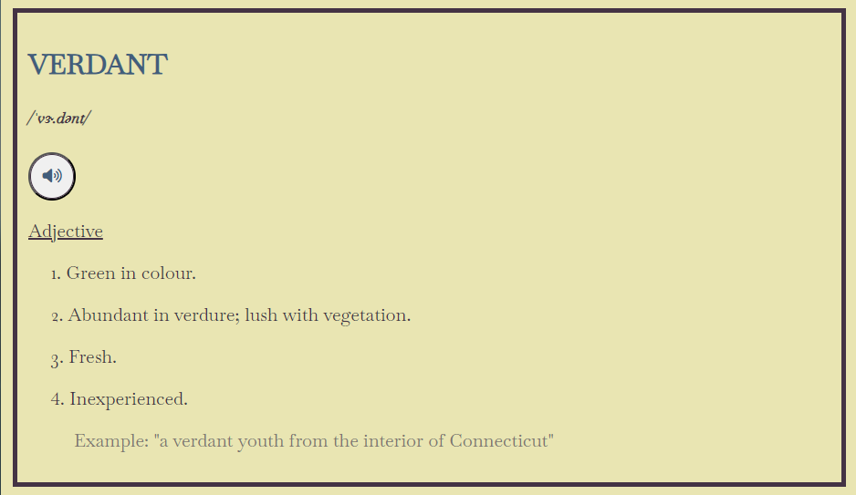

# Dictionary

## About The Project
This project lets users search for a word and read dictionary entries for them. Each result will display a list of definitions, part of speech, and sometimes example sentences, phonetic spelling, and phonetic audio.

With some experience with front-end technologies and working with APIs, I wanted to refine my skills by working with more complicated objects. As such, a dictionary, where fetched data can return several definition entries and parts of speech usages, proved to be a suitable challenge.

Some challenges I faced was figuring out the best way to pull data from the fetched data. Displaying all usages of each word as well as phonetic audio when available was my priority, and using if statements and for loops to navigate through arrays helped me make this project function.

### Built With
- HTML5
- CSS3
- JavaScript

## Usage
This project features one text field for the word you would like to learn more about. To submit searches, hit the 'Search' button.

Searching for a word will return the following information:
- Word
- Phonetic audio
- Phonetic spelling
- Part of speech
- Definition(s)
- Example sentence(s)

For instance, searching "verdant" will return at least one of these elements.

You can click on the speaker icon to hear the phonetic pronunciation of the word.

Sometimes the results do not contain phonetic spelling and pronunciation. In these cases, these features will be excluded in the results.

In certain cases, a word can have several definitions depending on the part of speech or context used. Multiple results will be shown on the screen.

Searching "shirt" will return two entries, each with different content.

A search will not display a valid result when:
- The word field is empty
- Free Dictionary API does not have data for the word

## Credits
- [Free Dictionary API](https://dictionaryapi.dev/ "Free Dictionary API") : API used to fetch results
- [GitHub Pages](https://pages.github.com/ "GitHub Pages") : Used to host project online
- [Font Awesome](https://fontawesome.com/) : Used for icons in the footer
- [Google Fonts](https://fonts.google.com/) : Used for Baskervville font